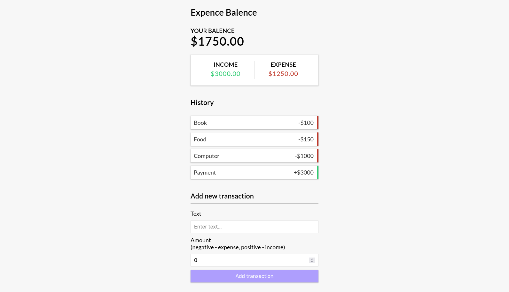

# React Project - Expence Balence

## Table of contents

- [Overview](#overview)
  - [The challenge](#the-challenge)
  - [Screenshot](#screenshot)
  - [Links](#links)
- [My process](#my-process)
  - [Built with](#built-with)
  - [What I learned](#what-i-learned)
- [Author](#author)
- [Acknowledgments](#acknowledgments)

## Overview

### The challenge

Users should be able to:

- Add New Transactions
- Remove Transactions
- View Balance, Income, Expenses, and Transaction History

### Screenshot

### Links

- Solution URL: [Solution URL here](https://github.com/styrexx/expenceBalance)
- Live Site URL: [Live site URL here](https://styrexx.github.io/expenceBalance)

## My process

### Built with

- Vite React
- React DOME
- Build in state manager
- Separate the design using components
- Mobile-first workflow

### What I learned

- I have learned the usage of Vite and its flexibility.
- Learn to think in terms of components instead of a whole web page.
- Understand state management.

## Author

- github - [Abdessamad](https://www.github.com/styrexx)
- Frontend Mentor - [Abdessamad](https://www.frontendmentor.io/profile/kop-left)
